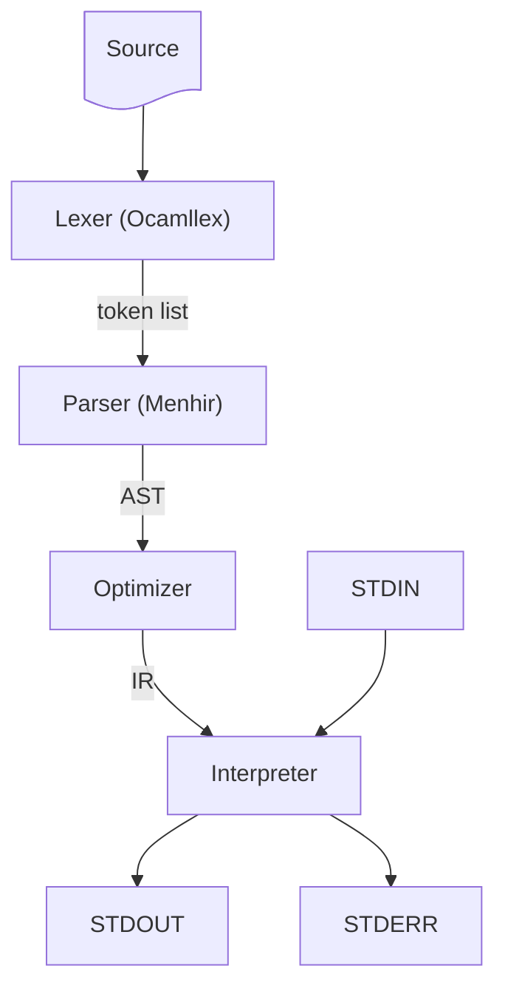

```mermaid
flowchart TD;
    Source@{ shape: doc, label: "Source"}
    Source --> Lexer["Lexer (Ocamllex)"];
    Lexer -->|token list| Parser["Parser (Menhir)"];
    Parser -->|AST| Optimizer;
    Optimizer -->|IR| Interpreter;
    STDIN --> Interpreter;
    Interpreter --> STDOUT;
    Interpreter --> STDERR;
```
